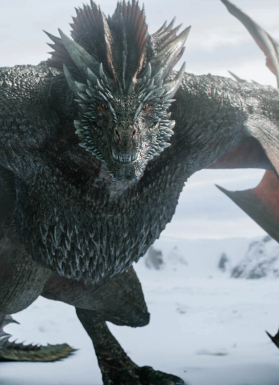

# CSE110-Lab-1 - The life of Daenarys Targaryen, by titles

***Spoiler ALERT***

**Daenarys Targaryen** had a great story for 6-7 seasons. Then i dont know why they decided she should suddenly go mad in season 8 and torch King's Landing with drogon :facepalm:

To clone this `README.md`, you can do

```
git clone https://github.com/StoneT2000/CSE110-Lab-1.git
```
You can find all images [here](assets/)


And now Daenarys's Story begins...

## Daenarys Stormborn of House Targaryen

Season 1 we see Daenarys enter the frame, as a Targaryen, but also as her brother's pawn in an attempt to control the Dothraki's army to take control of [Westeros](https://gameofthrones.fandom.com/wiki/Westeros)

It takes time, (more like 6 seasons) before Daenary's true strength is shown and she truly becomes Daenarys Stormborn of House Targaryen.


## Mother of Dragons, The Unburnt

In the Season 1 finale, we see Daenarys enter a fire that was meant to kill the witch that killed her Khal, Khal Drogo. By the next day, Daenarys emerged from the fire with 3 hatched dragons, [Drogon](#Drogon), [Viserys](#Viserys), and [Rhaegal](#Rhaegal). From then on, she is not only the Khaleesi, but also the Mother of Dragons and The Unburnt.

Also, Daenarys's brother is killed by Khal Drogo, so now technically, Daenary's is also titled "First of Her Name"

## Breaker of Chains

In Season 3, Daenarys explores the [~~Slavers Bay~~ Bay of Dragons](https://gameofthrones.fandom.com/wiki/Bay_of_Dragons), (renamed to Bay of Dragons by Daenarys from Slavers Bay) and lands at Astapor. Like a true Targaryen, she tricks Slave Master Kraznys into giving her an army of Unsullied soldiers and shouts *Dracarys*, burning the Slave Master alive. She then releases all of the soldiers from enslavement and they join her in her conquest of the slavers and then Westeros. Daenarys crosses over to Yunkai and Meeren, toppling the traditional slave social structures.

Now, Daenarys is the Breaker of Chains

## Queen of the Andals and the First Men, Protector of the Seven / Six / Five? Kingdoms

*sigh* (this is season 8 btw)

Daenarys travels across the narrow sea with her army of Unsullied and Dothraki. Falls in love with Jon Snow. Defeats a ton of lords in Westeros. And now her title is 

> Daenerys Stormborn of House Targaryen, the First of Her Name, Queen of the Andals and the First Men, Protector of the Seven Kingdoms, the Mother of Dragons, the Khaleesi of the Great Grass Sea, the Unburnt, the Breaker of Chains

quoting poor Missandei (her loyal advisor she freed from Kraznys) who probably says this every other day

## Appendix A - The Dragons

### Drogon



Biggest dragon of them all, and also gets the most screen time

### Viserys

Ultimately converted into a undead dragon.

### Rhaegal

Somehow dies to 4 scorpion bolts (giant crossbow bolts) yet Drogon dodges all of them??????

Season 8 logic = none

## Because the Assignment requires this

### Lists Everywhere
- hello
- there
- list!
#### Numbered Lists
1. this
2. is
3. a
4. numbered list
#### Nested Lists
1. First item
  - nested item
    - another nested item
      1. even more nesting :o
      2. how is this possible!

## Things for HBO to do

- [x] turn a Song of Ice and Fire into a TV show called Game of Thrones
- [ ] remake the final season
- [ ] remake the final season
- [ ] remake the final season
- [ ] remake the final season

